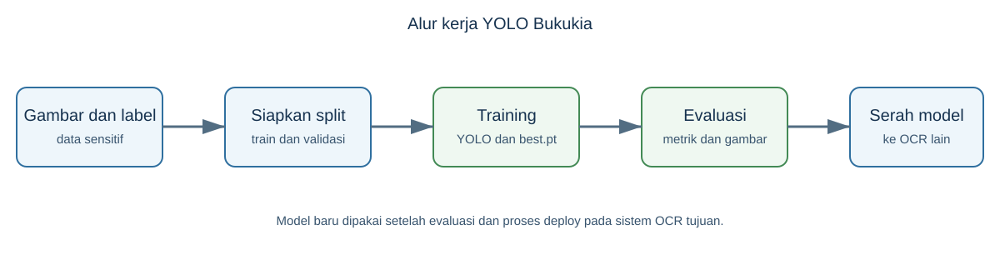

# Mulai dari Nol — YOLO Bukukia Training Pipeline

Repository ini dipakai untuk melatih model yang menemukan area penting pada halaman Buku KIA, misalnya lima segmen halaman dan kolom NIK. Model hasil training dipakai oleh sistem OCR lain untuk menentukan bagian gambar yang perlu dibaca.

Ini bukan aplikasi web dan tidak memiliki URL, API, atau proses server yang terus hidup. Semua pekerjaan dilakukan sebagai proses batch: siapkan data, latih model, evaluasi hasil, lalu kirim file model yang sudah disetujui.

## 1. Sebelum mulai

1. Pastikan Anda berwenang mengakses gambar Buku KIA dan labelnya. Nama file maupun isi gambar dapat memuat NIK, nama, dan alamat.
2. Siapkan environment Python terpisah.
3. Jangan memasukkan folder data, hasil training, atau file model ke Git. .gitignore sudah mengecualikan folder tersebut, tetapi tetap periksa status Git sebelum commit.
4. Baca docs/00-concept/README.md untuk konteks per peran dan docs/02-technical/ARSITEKTUR-DAN-SCRIPT.md untuk detail script.

## 2. Menyiapkan environment

~~~bash
python -m venv .venv
source .venv/bin/activate
pip install -r requirements.txt
~~~

Script dapat berjalan di komputer lokal, Google Colab, atau VM GPU. scripts/config.py menentukan perangkat yang dipakai secara otomatis. Latihan di CPU tetap mungkin, tetapi jauh lebih lambat dibanding GPU.

## 3. Struktur data yang dibutuhkan

| Lokasi | Isi |
|---|---|
| input_files/raw_images/ | Gambar untuk training |
| input_files/export/labels/ | Label YOLO, satu file .txt untuk satu gambar |
| input_files/export/classes.txt | Nama kelas, satu baris satu kelas |
| input_files/test-dataset/ | Gambar dan label terpisah untuk evaluasi |
| results/ | Dataset hasil split, model, metrik, dan gambar laporan |

Setiap baris label YOLO berisi class_id x_center y_center width height. Semua nilai koordinat dinormalisasi antara 0 dan 1.

## 4. Urutan kerja yang disarankan

### Langkah 1 — periksa pasangan gambar dan label

Nama gambar dan label harus cocok. train_2.py hanya memakai pasangan yang ditemukan. Label tanpa gambar akan dilaporkan, tetapi tidak dipakai.

### Langkah 2 — jalankan training

~~~bash
python scripts/train_2.py --epochs 80 --imgsz 640 --batch -1
~~~

Script akan membuat ulang results/dataset/, membagi data menjadi train/validation dengan rasio 80/20, lalu menyimpan model terbaik di results/runs/train/weights/best.pt.

### Langkah 3 — evaluasi

~~~bash
python scripts/test_model.py --model results/runs/train/weights/best.pt
~~~

Hasil evaluasi tersimpan di results/test_results/, termasuk gambar beranotasi, CSV per kelas, dan dashboard. Jangan menilai model hanya dari satu angka; lihat juga kelas yang sering terlewat.

### Langkah 4 — fine-tuning bila benar-benar diperlukan

Ada dua jalur: fine_tune.py dan fine_tune_tuningmanual.py. Pilih satu. run_pipeline.py dengan opsi fine-tune memiliki ketidaksesuaian nama argumen dengan fine_tune.py, sehingga jangan gunakan opsi ini sebelum memeriksa atau memperbaikinya.

### Langkah 5 — serahkan model

Hanya kirim best.pt yang telah dievaluasi dan diberi versi jelas kepada pemilik sistem OCR. Menyalin file model baru tidak otomatis mengubah sistem OCR produksi.

## 5. Hal yang sering membingungkan

- run_pipeline.py tidak menjalankan training; ia hanya membantu analisis, evaluasi, dan fine-tuning opsional.
- Split 80/20 dibuat ulang saat training. Gunakan opsi split-dir jika ingin split yang tetap.
- IoU per epoch dapat berupa estimasi fallback. Periksa sumber metrik sebelum menjadikannya dasar keputusan.
- Script filter untuk kelas 2023/2024 lama tidak sejalan dengan classes.txt aktif. Jangan gunakan tanpa memeriksa mapping kelas.

## 6. Batas keamanan data

- Jangan unggah data Buku KIA ke Colab sebelum ada persetujuan dan kebijakan penanganan data.
- Jangan menaruh nama, NIK, gambar, label mentah, atau berkas model di tiket dan chat umum.
- Hapus salinan sementara pada komputer pribadi setelah tidak diperlukan.
- Catat asal data, versi kelas, parameter training, dan hasil evaluasi setiap kali model baru dibuat.

## 7. Dokumen lanjutan

- docs/00-concept/README.md — ringkasan untuk PM, data, AI, keamanan, dan DevOps.
- docs/02-technical/ARSITEKTUR-DAN-SCRIPT.md — perilaku masing-masing script.
- README.md di root — referensi awal script dan notebook.
